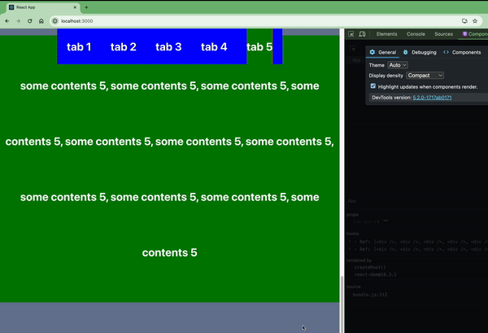

# fe-tabs-refs-sections

Auther: Danny Cui

## Desc

This is a sample code about how to use `useRef` to 2 way binding top tabs bar with sections without `useEffect` or any page re-render in `reactjs`.

## Demo

## Available Scripts

In the project directory, you can run:

### `npm start`
